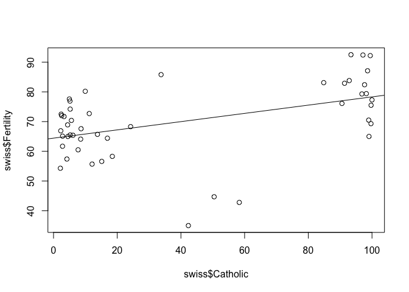

Swiss dataset Exploration
================
Vetle Birkeland Huglen
18 9 2018

In this part of the homework I will briefly explore the "swiss" dataset in R, which shows a handful of socio-economic indicators, along with fertility rate, for all French-speaking provinces of Switzerland. The statistics are from about 1888. Firstly, let us take a quick look at the format of the dataset:

``` r
head(swiss)
```

    ##              Fertility Agriculture Examination Education Catholic
    ## Courtelary        80.2        17.0          15        12     9.96
    ## Delemont          83.1        45.1           6         9    84.84
    ## Franches-Mnt      92.5        39.7           5         5    93.40
    ## Moutier           85.8        36.5          12         7    33.77
    ## Neuveville        76.9        43.5          17        15     5.16
    ## Porrentruy        76.1        35.3           9         7    90.57
    ##              Infant.Mortality
    ## Courtelary               22.2
    ## Delemont                 22.2
    ## Franches-Mnt             20.2
    ## Moutier                  20.3
    ## Neuveville               20.6
    ## Porrentruy               26.6

It could also be useful to look at some summary statistics.

``` r
summary(swiss)
```

    ##    Fertility      Agriculture     Examination      Education    
    ##  Min.   :35.00   Min.   : 1.20   Min.   : 3.00   Min.   : 1.00  
    ##  1st Qu.:64.70   1st Qu.:35.90   1st Qu.:12.00   1st Qu.: 6.00  
    ##  Median :70.40   Median :54.10   Median :16.00   Median : 8.00  
    ##  Mean   :70.14   Mean   :50.66   Mean   :16.49   Mean   :10.98  
    ##  3rd Qu.:78.45   3rd Qu.:67.65   3rd Qu.:22.00   3rd Qu.:12.00  
    ##  Max.   :92.50   Max.   :89.70   Max.   :37.00   Max.   :53.00  
    ##     Catholic       Infant.Mortality
    ##  Min.   :  2.150   Min.   :10.80   
    ##  1st Qu.:  5.195   1st Qu.:18.15   
    ##  Median : 15.140   Median :20.00   
    ##  Mean   : 41.144   Mean   :19.94   
    ##  3rd Qu.: 93.125   3rd Qu.:21.70   
    ##  Max.   :100.000   Max.   :26.60

``` r
str(swiss)
```

    ## 'data.frame':    47 obs. of  6 variables:
    ##  $ Fertility       : num  80.2 83.1 92.5 85.8 76.9 76.1 83.8 92.4 82.4 82.9 ...
    ##  $ Agriculture     : num  17 45.1 39.7 36.5 43.5 35.3 70.2 67.8 53.3 45.2 ...
    ##  $ Examination     : int  15 6 5 12 17 9 16 14 12 16 ...
    ##  $ Education       : int  12 9 5 7 15 7 7 8 7 13 ...
    ##  $ Catholic        : num  9.96 84.84 93.4 33.77 5.16 ...
    ##  $ Infant.Mortality: num  22.2 22.2 20.2 20.3 20.6 26.6 23.6 24.9 21 24.4 ...

Now, I wanna look further into the "fertility" feature.

``` r
fertility = swiss$Fertility
mean(fertility)
```

    ## [1] 70.14255

``` r
max(fertility)
```

    ## [1] 92.5

``` r
min(fertility)
```

    ## [1] 35

``` r
sd(fertility)
```

    ## [1] 12.4917

``` r
var(fertility)
```

    ## [1] 156.0425

I wanna sort the provinces by fertilityrate, but I am only interested in the Fertility and Catholic features:

``` r
rownames_to_column(swiss, var = "rowname") %>%
  select(rowname, Fertility, Catholic) %>%
    arrange(desc(Fertility))
```

    ## Warning: package 'bindrcpp' was built under R version 3.4.4

    ##         rowname Fertility Catholic
    ## 1  Franches-Mnt      92.5    93.40
    ## 2         Glane      92.4    97.16
    ## 3        Sierre      92.2    99.46
    ## 4       Veveyse      87.1    98.61
    ## 5       Moutier      85.8    33.77
    ## 6         Broye      83.8    92.85
    ## 7      Delemont      83.1    84.84
    ## 8        Sarine      82.9    91.38
    ## 9       Gruyere      82.4    97.67
    ## 10   Courtelary      80.2     9.96
    ## 11      Monthey      79.4    98.22
    ## 12         Sion      79.3    96.83
    ## 13   Val de Ruz      77.6     4.97
    ## 14       Herens      77.3   100.00
    ## 15   Neuveville      76.9     5.16
    ## 16   Porrentruy      76.1    90.57
    ## 17      Conthey      75.5    99.71
    ## 18      Payerne      74.2     5.23
    ## 19     Le Locle      72.7    11.22
    ## 20         Oron      72.5     2.40
    ## 21 Paysd'enhaut      72.0     2.56
    ## 22     Grandson      71.7     3.30
    ## 23     Martigwy      70.5    98.96
    ## 24       Boudry      70.4     5.62
    ## 25    Entremont      69.3    99.68
    ## 26     Avenches      68.9     4.43
    ## 27    Echallens      68.3    24.20
    ## 28 ValdeTravers      67.6     8.65
    ## 29      Aubonne      66.9     2.27
    ## 30 La Chauxdfnd      65.7    13.79
    ## 31       Morges      65.5     5.23
    ## 32      Yverdon      65.4     6.10
    ## 33       Lavaux      65.1     2.84
    ## 34       Moudon      65.0     4.52
    ## 35   St Maurice      65.0    99.06
    ## 36    Neuchatel      64.4    16.92
    ## 37        Aigle      64.1     8.52
    ## 38     Cossonay      61.7     2.82
    ## 39        Rolle      60.5     7.72
    ## 40        Vevey      58.3    18.46
    ## 41         Orbe      57.4     4.20
    ## 42        Nyone      56.6    15.14
    ## 43     Lausanne      55.7    12.11
    ## 44    La Vallee      54.3     2.15
    ## 45  Rive Droite      44.7    50.43
    ## 46  Rive Gauche      42.8    58.33
    ## 47 V. De Geneve      35.0    42.34

Now, I notice that the provinces with highest Fertility also has quite high value of Catholic. Lets do a quick linear regression and see what we get!

``` r
fit = lm(Fertility ~ Catholic, data=swiss)
summary(fit)
```

    ## 
    ## Call:
    ## lm(formula = Fertility ~ Catholic, data = swiss)
    ## 
    ## Residuals:
    ##     Min      1Q  Median      3Q     Max 
    ## -35.309  -4.060   0.511   6.851  16.682 
    ## 
    ## Coefficients:
    ##             Estimate Std. Error t value Pr(>|t|)    
    ## (Intercept) 64.42826    2.30510  27.950  < 2e-16 ***
    ## Catholic     0.13889    0.03956   3.511  0.00103 ** 
    ## ---
    ## Signif. codes:  0 '***' 0.001 '**' 0.01 '*' 0.05 '.' 0.1 ' ' 1
    ## 
    ## Residual standard error: 11.19 on 45 degrees of freedom
    ## Multiple R-squared:  0.215,  Adjusted R-squared:  0.1976 
    ## F-statistic: 12.33 on 1 and 45 DF,  p-value: 0.001029

``` r
plot(swiss$Catholic, swiss$Fertility)
abline(fit)
```

 This plot indicates a small rise in Fertility as function of Catholic. This is, however, a very bad linear regression. As seen in the plot, most of the variance in Fertility is left unexplained by the Catholic feature. Regardless, the low p-value shows that there with high probability exists some correlation between the two features.

This was a very shallow exploration of the swiss dataset, but it highlights some of the possibilities R possesses.
